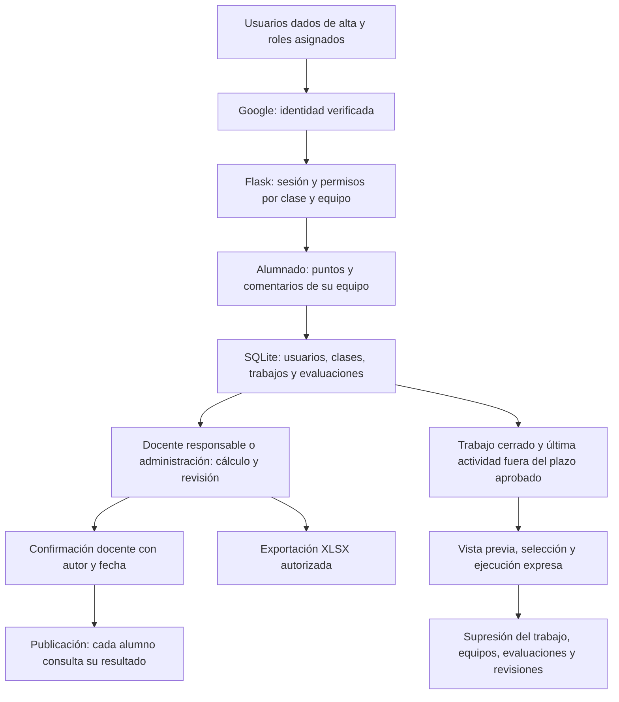

# Coevaluación de equipos · Cuatrovientos

Aplicación web con Flask y Angular 22 para autoevaluación y coevaluación confidencial de trabajos en equipo. Interfaz en español, fondo blanco, color principal `#0f4285` y tipografía Segoe UI. Los componentes Angular y los correos tienen sus plantillas HTML en archivos separados. El código fuente conserva formato y saltos de línea; solo la distribución de producción se minifica.

## Adecuación al RGPD

Documentación revisada el 9 de octubre de 2026 a partir de los diagramas del informe inicial y del código actual. Describe las medidas implementadas; la configuración y autorización de producción deben comprobarse aparte.

La aplicación incorpora identidad Google verificada, altas y roles explícitos, permisos por clase y equipo y confirmación docente registrada antes de publicar resultados. El dominio no asigna permisos por sí solo. La conservación de trabajos cerrados es configurable: la supresión requiere superar el plazo desde la última actividad, revisar la vista previa, seleccionar los trabajos y ejecutar expresamente el borrado. Las cuentas, exportaciones y copias requieren revisión separada.

Estos controles apoyan la adecuación al RGPD, pero no acreditan por sí solos el cumplimiento ni sustituyen la autorización del centro. Antes del uso con datos reales deben verificarse en el despliegue, completar la información de privacidad, revisar proveedores y condiciones de tratamiento y aprobar la conservación y el borrado, incluidas copias y exportaciones.

La página `/privacidad` muestra `PRIVACY_CONTROLLER`, `PRIVACY_CONTACT`, `PRIVACY_LEGAL_BASIS`, `PRIVACY_RETENTION` y `PRIVACY_PROVIDERS`, configuradas en el `.env` de cada despliegue (`backend/.env` en Generador de equipos). `PRIVACY_RETENTION` es texto informativo y no activa el borrado. Consulta los plazos y comandos operativos en la guía específica.

[Guía de privacidad](docs/PRIVACIDAD_Y_CONSERVACION.md) · [Web](https://coevaluacionequipos.eu.pythonanywhere.com/).

El enlace utiliza el nuevo dominio europeo. La migración está en curso según la información disponible; debe confirmarse su finalización, la versión desplegada y el tratamiento de las copias del alojamiento anterior. Alojar en Europa no determina dónde procesan los datos otros proveedores.

## Flujo de funcionamiento y datos



Los pasos de conservación representan una operación de mantenimiento que debe configurarse y ejecutarse; no un borrado automático por el mero transcurso del plazo.


## Funcionalidades

- Inicio de sesión con Google y correo verificado, sin registro libre.
- Profesorado: alta explícita por administración y cuenta Workspace del dominio configurado.
- Alumnado: alta por administración o inclusión en un equipo; dominios configurables. El dominio no asigna el rol.
- Administrador inicial: `ander_frago@cuatrovientos.org`.
- CRUD de usuarios por el administrador; desactivación para conservar historial.
- Clases, trabajos con fecha límite, equipos de 2 a 50 integrantes y nota grupal por equipo.
- Enlace de evaluación por equipo y envío individual de invitaciones por correo.
- Reparto de puntos enteros, autoevaluación incluida, edición hasta el cierre.
- Comentarios opcionales y advertencias informativas MR/MH.
- Revisión confidencial por el docente responsable y el administrador.
- Cierre, reapertura, publicación y retirada de resultados.
- Exportación XLSX con hojas de resultados, repartos y criterios.
- Aviso público de privacidad configurable en `/privacidad`.
- Confirmación docente registrada antes de publicar notas.
- Conservación configurable, vista previa y supresión de trabajos seleccionados mediante consola.

## Actualización de privacidad y acceso

Consulta [la guía de actualización y conservación](docs/PRIVACIDAD_Y_CONSERVACION.md) antes de actualizar una instalación existente. Hay dos tablas nuevas que se añaden con `init-db`, sin borrar las anteriores. Revisa las cuentas ya existentes, configura los dominios y completa la información institucional. El plazo de conservación se deja sin definir hasta que lo establezca el centro; no se ha instalado un borrado automático.

Estos controles técnicos no sustituyen la autorización del centro, los contratos con proveedores ni la evaluación del DPD.

## Reglas de cálculo

```text
N = integrantes del equipo
Presupuesto de cada evaluador = 3 × N
X1 = suma de puntos recibidos por el alumno
Factor individual = X1 / (3 × N)
Porcentaje = 100 × factor individual
Nota sin límite = nota grupal × factor individual
Nota individual = mínimo(10, nota sin límite)
```

Se emplea aritmética decimal y redondeo final a dos decimales (`ROUND_HALF_UP`). El porcentaje mostrado también se redondea, pero nunca se reutiliza para calcular la nota.

Ejemplo: 3 integrantes, X1 = 6 y nota grupal = 7 → 66,67 % → **4,67**.

Cada persona debe repartir exactamente su presupuesto entre todos, incluida ella misma. Se admiten valores enteros de 0 al presupuesto completo. En un equipo de 4 se reparten 12 puntos por evaluador.

| Advertencia | Cuándo aparece | Efecto |
| --- | --- | --- |
| MR · Mal repartido | Un reparto incluye un 0, concentra todo en una persona o asigna lo mismo a todos | Informativo; no modifica la nota |
| MH · Matrícula de Honor | La nota calculada antes del límite supera 10 | Se muestra MH y la nota final es 10 |

MR se calcula por evaluación: el docente puede ver quién hizo ese reparto y sus motivos. También se muestra MR en la cabecera del equipo si algún reparto lo genera. Una nota de exactamente 10 no activa MH.

Sin todas las evaluaciones o sin nota grupal, las notas individuales quedan **pendientes**, sin tratar las respuestas ausentes como ceros. El docente puede ampliar la fecha o reabrir el trabajo. Solo se publican trabajos con todos sus equipos completos. Publicar cierra la edición; retirar la publicación permite volver a gestionar el trabajo.

## Puesta en marcha local (PowerShell)

Necesitas Python 3.10 o posterior y una versión de Node compatible con Angular 22: `^22.22.3`, `^24.15.0` o `^26.0.0`. TypeScript se instala con el proyecto. [Compatibilidad oficial de Angular](https://angular.dev/reference/versions).

```powershell
python -m venv .venv
.venv/Scripts/python.exe -m pip install -r requirements-dev.txt -c constraints.txt
Copy-Item .env.example .env
.venv/Scripts/python.exe -c "import secrets; print(secrets.token_urlsafe(48))"
```

Pega la clave generada en `SECRET_KEY` dentro de `.env`. Para uso local mantén `BASE_URL=http://localhost:5000` y `COOKIE_SECURE=false`. Completa las credenciales de Google siguiendo el manual.

```powershell
cd frontend
npm.cmd ci
npm.cmd run build
cd ..
.venv/Scripts/python.exe -m flask --app wsgi:application init-db
.venv/Scripts/python.exe -m flask --app wsgi:application run --host localhost --port 5000
```

Abre `http://localhost:5000`. Sin credenciales de Google se muestra la pantalla de acceso, pero no se puede autenticar. No existe un acceso alternativo de desarrollo en la aplicación.

Para edición del frontend con recarga automática, ejecuta Flask en un terminal y `npm.cmd start` dentro de `frontend` en otro. Abre `http://localhost:4200` y cambia `BASE_URL` a ese origen, registrando `http://localhost:4200/auth/google/callback` en Google. Reinicia Flask después de modificar `.env`. El proxy de Angular envía `/api` y `/auth` a Flask.

## Verificación y formato

```powershell
.venv/Scripts/python.exe -m pytest -q
.venv/Scripts/python.exe -m ruff check backend tests wsgi.py scripts
.venv/Scripts/python.exe -m ruff format --check backend tests wsgi.py scripts
cd frontend
npm.cmd run format:check
npm.cmd run build
```

Para reformatear usa `ruff format` y `npm.cmd run format`. Las pruebas usan una base SQLite en memoria, identidades simuladas y un servidor de correo simulado. Nunca envían correos reales ni usan cuentas Google reales.

## Estructura

```text
backend/
  __init__.py             Configuración, seguridad y servicio del frontend
  auth.py                 Inicio de sesión Google y asignación inicial de roles
  models.py               Modelo de datos SQLAlchemy
  routes.py               API y permisos
  grading.py              Fórmulas y advertencias
  export.py               Exportación XLSX
  mail.py                 Invitaciones SMTP
  templates/              Plantillas HTML y texto del correo
frontend/
  src/app/                Componentes TypeScript y plantillas HTML separadas
  src/styles.css          Estilos compartidos y adaptaciones a móvil
  package-lock.json       Dependencias reproducibles del frontend
docs/
  DESPLIEGUE_PYTHONANYWHERE.md
  MANUAL_USUARIO.md
scripts/package.py        Paquete de despliegue sin secretos ni base de datos
tests/test_app.py          Pruebas de integración y de cálculo
wsgi.py                   Punto de entrada de producción
```

## Despliegue

Consulta [el manual de PythonAnywhere](docs/DESPLIEGUE_PYTHONANYWHERE.md) y [el manual de uso](docs/MANUAL_USUARIO.md).

```powershell
.venv/Scripts/python.exe scripts/package.py
```

Genera `dist/coevaluacion-pythonanywhere.zip`, incluyendo el frontend compilado. La cuenta PythonAnywhere, el cliente OAuth y la cuenta remitente deben configurarse antes del uso real.
